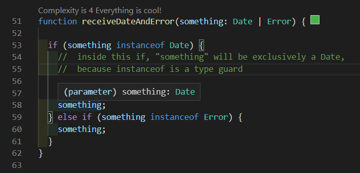
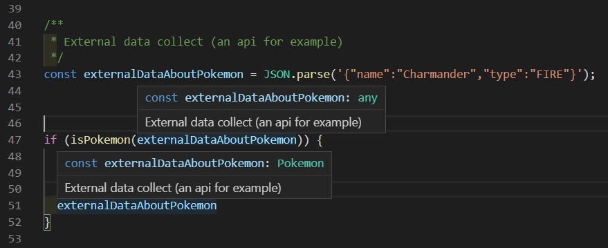

# TypeScript Enum Type Guard
Some simple tools for TypeScript, it will help your daily development

> taipescripeto custos autem enumeratio

[](https://badge.fury.io/js/%40taipescripeto%2Fenum-type-guard)
[](https://travis-ci.org/lordazzi/taipescripeto-enum-type-guard)
[](https://github.com/lordazzi/taipescripeto-enum-type-guard/blob/master/LICENSE)

## Installation

```bash
npm install @taipescripeto/enum-type-guard --save
```

# Usage
A type guard is a method or keyword with power of something like cast in TypeScript.
When a type guard is used to check the type of an information in a conditional structure, the following code assume the validated type as the information type.



This feature is basically the Type Guard to identify enum data.

```typescript
import { enumTypeGuard } from '@taipescripeto/enum-type-guard';

/**
 * The application domain
 */
enum PokemonType {
  FIRE = 'FIRE',
  GRASS = 'GRASS',
  WATER = 'WATER'
}

interface Pokemon {
  name: string;
  type: PokemonType;
}

/**
 * External data collect (an api for example)
 */
const externalDataAboutPokemon = JSON.parse('{"name":"Charmander","type":"FIRE"}');

/**
 * Type Guard function
 */
function isPokemon(pokemonIGuess: unknown): pokemonIGuess is Pokemon {
  //  If it is null or isn't an object, isn't a Pokémon model
  if (!pokemonIGuess || !(pokemonIGuess instanceof Object)) {
    return false;
  }

  //  ignore that
  const someObject = pokemonIGuess as { [prop: string]: unknown };

  //  the type check
  if (
    !(typeof someObject.name === 'string' &&
      enumTypeGuard(someObject.type, PokemonType))
  ) {
    return false;
  }

  return true;
}

if (isPokemon(externalDataAboutPokemon)) {
  externalDataAboutPokemon
}
```

You can see in this print the TypeScript recognizing the external data as an enum:


## Contributing

### 1. Create an issue
No one feature will be implemented without it having an open issue and without which the proposed has been accepted by the team responsible for the project. After the issue is approved, the applicant, a team member or anyone else can open a pull request associated with that issue (just paste the issue link in the pull request).

### 2. Did you find a bug?
When logging a bug, please be sure to include the following:
 * The library version;
 * If at all possible, an *isolated* way to reproduce the behavior;
 * The behavior you expect to see, and the actual behavior.

You can try to update the library to the last version to see if the bug has already been fixed.

### 3. Do not create a duplicate issue
[Search the existing issues](https://github.com/lordazzi/taipescripeto-enum-type-guard/search?type=Issues) before logging a new one.

Some search tips:
 * *Don't* restrict your search to only open issues. An issue with a title similar to yours may have been closed as a duplicate of one with a less-findable title.
 * Check for synonyms. For example, if your bug involves an interface, it likely also occurs with type aliases or classes.

### 4. Create a Pull Request
Follow the steps:

 * Create a [fork](https://guides.github.com/activities/forking/) from our repository, install [node](https://nodejs.org/), and run `npm install` in the application folder;
 * Create a branch in your forked repository, then code the feature or fix the bug;
 * Run `npm run lint`, `npm run test` and `npm run build` in the repository;
 * Create a Pull Request from your repository to this one, with the issue in the body and some information you think could be usefull to the reviewer (print or a [gif of it working](https://www.screentogif.com/) will be appreciated);
 * The reviewer can ask some changes, don't be mad, this is the GIT Flow process;
 * You get approved and your branch with the feature / fix 